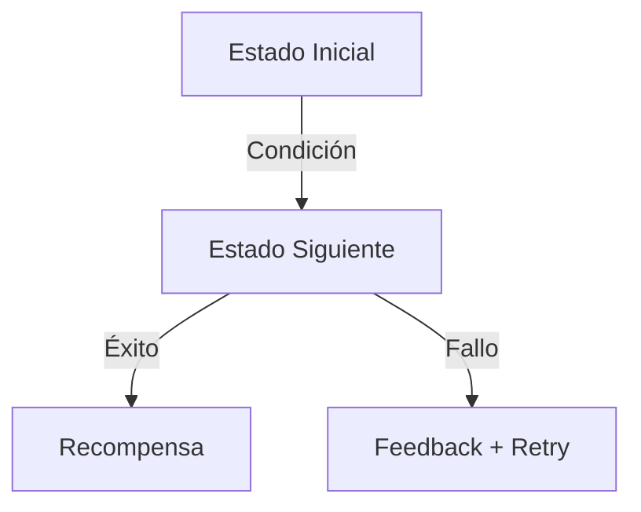

# Skill: Mapas Anotados y Documentación de Estructuras

> Fuente: "Level Design Book" — Sección 4.3 (Herramientas de Documentación Profesional)

## Cuándo Usar Este Skill

Cuando el Archivist documenta layouts de zonas, estructuras de juego, flujos de progresión, o relaciones entre sistemas.

## Principio Central

> Un layout físico no es suficiente; se requiere una metodología de Mapas Anotados que centralice datos para todos los departamentos.

## Metodología de Mapas Anotados

Todo documento de estructura (aldea, zona, tech tree) DEBE incluir anotaciones para cada departamento:

### Capas de Anotación

| Capa                 | Responsable  | Qué Documenta                              | Ejemplo                                                                          |
| -------------------- | ------------ | ------------------------------------------ | -------------------------------------------------------------------------------- |
| **Code/Interactive** | @developer   | Estados de objetos, colisiones, triggers   | "Lumber Mill: 2 estados (idle, producing). Trigger: recolección cada X segundos" |
| **Art**              | @artdirector | Assets necesarios, referencias visuales    | "Lumber Mill Lv1: sprite 64x64, silueta triangular, paleta marrón"               |
| **Audio**            | @artdirector | Eventos sonoros por zona/objeto            | "Producción: sfx_wood_chop loop. Upgrade: sfx_construction_complete one-shot"    |
| **Design**           | @gamedesign  | Balance, producción, relaciones económicas | "Produce 100 wood/hr Lv1. Coste: 50 wood. Unlock: Great Hall Lv1"                |
| **Story/Narrative**  | @gamedesign  | Contexto narrativo, lore, flavor text      | "Los leñadores de Yggdrasil proveen la madera sagrada para la aldea"             |

## Flowcharts Obligatorios

> Los Flowcharts son críticos para capturar la lógica condicional y el scripting que un mapa 2D es incapaz de mostrar.

### Cuándo Crear un Flowchart

| Situación           | Tipo de Flowchart                       | Formato              |
| ------------------- | --------------------------------------- | -------------------- |
| Flujo de tutorial   | Secuencial con branches (skip/complete) | Mermaid flowchart    |
| Tech tree / Unlock  | Árbol de dependencias                   | Mermaid flowchart TD |
| Estados de edificio | Máquina de estados                      | Mermaid stateDiagram |
| Flujo de combate    | Secuencia de acciones                   | Mermaid sequence     |
| Economía            | Flujo de recursos (source → sink)       | Mermaid flowchart LR |

### Template de Flowchart Mermaid

````markdown
### Flujo: [Nombre]


````

**Nodos obligatorios:**

- Estado inicial (siempre verde: `:::success`)
- Condiciones de transición (en las flechas)
- Estados de error/feedback (siempre con salida)
- Estado final / recompensa

````

## Estructura de Documento de Zona/Layout

```markdown
# 🗺️ [Nombre de la Zona/Layout]

## Overview
[1-2 frases: qué es y por qué existe]

## Mapa Anotado

### Layout
[ASCII art o diagrama Mermaid del espacio]

### Capa Code/Interactive
| Objeto | ID | Estados | Trigger |
| --- | --- | --- | --- |

### Capa Art
| Objeto | Asset Ref | Tamaño | Animaciones |
| --- | --- | --- | --- |

### Capa Audio
| Evento | Sound ID | Tipo | Loop? |
| --- | --- | --- | --- |

### Capa Design
| Objeto | Producción | Coste | Prerrequisito |
| --- | --- | --- | --- |

## Flowchart de Progresión
[Mermaid diagram]

## Modelo de Pacing
| Fase (Freytag) | Actividad en esta zona | Duración estimada |
| --- | --- | --- |

## Cross-References
- Economía: [link a economy.md]
- Edificios: [link a economy-and-buildings.md]
- Config: [link a BuildingsConfig.json]

---
_Documentado por @archivist. Validado por @qa._
````

## Reglas de Calidad

| Regla         | Criterio                                         | Verificación                                |
| ------------- | ------------------------------------------------ | ------------------------------------------- |
| Completitud   | Las 5 capas de anotación están presentes         | Checklist visual                            |
| Consistencia  | Los datos coinciden con JSON configs             | Comparar vs BuildingsConfig/ResourcesConfig |
| Navegabilidad | Todos los cross-references son links funcionales | Click-test                                  |
| Flowcharts    | Toda lógica condicional tiene diagrama           | Buscar "if/then" sin diagrama               |
| Actualizado   | Fecha de última revisión < 2 semanas             | Header del documento                        |
