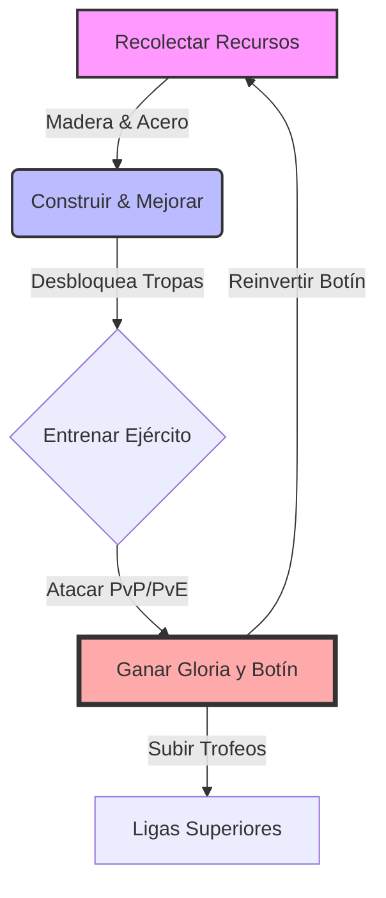

# 🎮 Visión General: Project Valhalla

## 📝 Resumen

**Project Valhalla** es un juego móvil de estrategia, city builder y gestión de recursos fuertemente inspirado en _Clash of Clans_, pero ambientado en la **Mitología Nórdica** (Vikingos, Dioses, Asgard).

## 🎯 Público Objetivo y Monetización

- **Target:** Mid-core gamers, 16-40 años. Jugadores competitivos que disfrutan de la gestión a largo plazo y el PvP.
- **Monetización:**
  - **In-App Purchases (IAP):** "Runas" (Hard Currency) para acelerar tiempos y comprar recursos.
  - **Battle Pass:** "Camino del Einherjar" (Recompensas cosméticas y aceleradores mensuales).
  - **Ofertas limitadas:** Packs de inicio, ofertas de fin de semana.

## 🔄 Core Loop (Bucle Principal)

1. **Recolectar:** Extraer "Madera de Yggdrasil" y "Acero Enano" (Soft Currencies).
2. **Construir:** Mejorar el "Gran Salón" (Ayuntamiento), defensas (Torres de Arqueros, Catapultas de Hielo) y edificios de recursos.
3. **Entrenar:** Crear tropas vikingas (Berserkers, Valquirias, Jarls) y criaturas míticas (Lobos Huargo, Trolls).
4. **Atacar:** Asaltar asentamientos de otros jugadores (PvP) o campamentos de Jotuns (PvE) para robar recursos y ganar "Gloria" (Trofeos).

## 📈 KPIs Esperados

- **Retención D1:** 45%
- **Retención D7:** 18%
- **Retención D30:** 8%
- **ARPDAU:** $0.20

---

_Aprobado por `@producer`._
