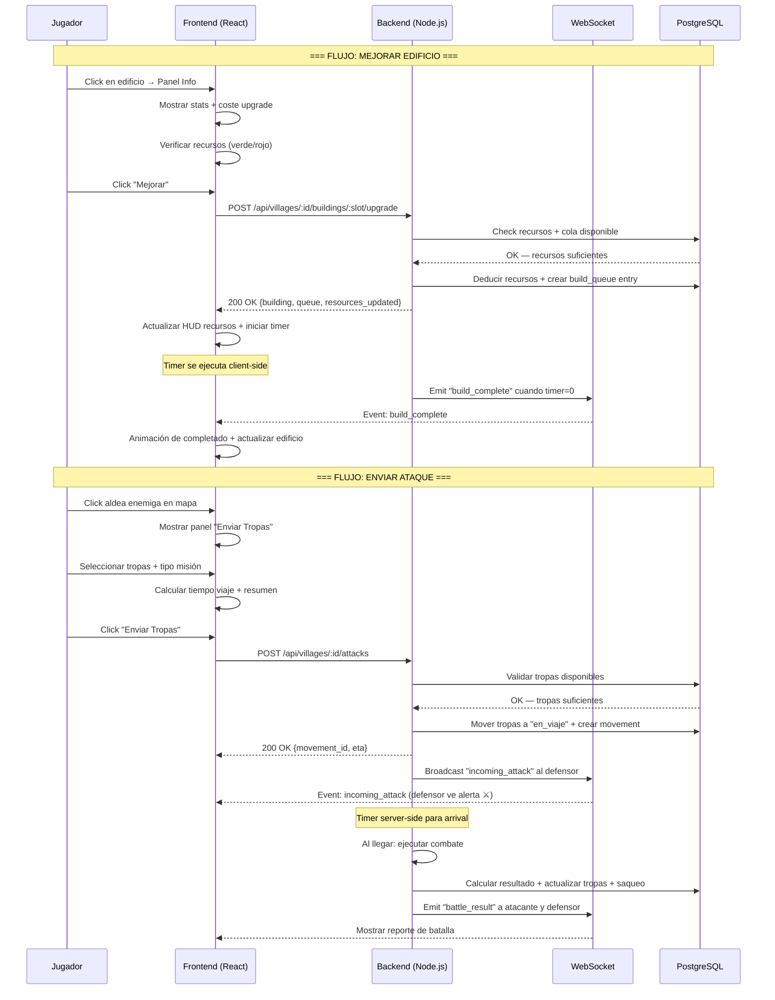
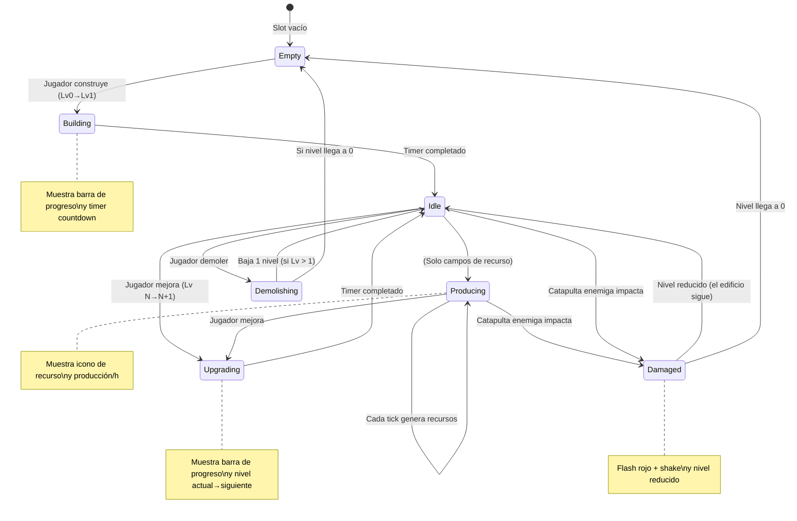

# 🎨 Dirección Visual — Midgard Online

> Guía de estilo completa para un juego web MMO de estrategia tipo Travian con temática nórdica.
> Plataforma: **Web (desktop-first, responsive)**. Stack: React + TypeScript.
> Referencia: [vision.md](../vision.md) | [buildings.md](../buildings.md) | [troops.md](../troops.md) | [map.md](../map.md)

---

## 1. 🎨 Paleta de Colores

### 1.1 Colores Base — UI

| Token                | Hex       | RGB           | Uso                                            |
| -------------------- | --------- | ------------- | ---------------------------------------------- |
| `--bg-primary`       | `#0f1923` | 15, 25, 35    | Fondo principal del juego (noche nórdica)      |
| `--bg-secondary`     | `#1a2a3a` | 26, 42, 58    | Paneles, sidebars, cards                       |
| `--bg-tertiary`      | `#243447` | 36, 52, 71    | Inputs, dropdowns, tablas alternas             |
| `--bg-elevated`      | `#2e4058` | 46, 64, 88    | Modals, tooltips, popovers                     |
| `--border-default`   | `#3a5068` | 58, 80, 104   | Bordes de cards, separadores                   |
| `--border-highlight` | `#5a7a98` | 90, 122, 152  | Bordes hover, elemento seleccionado            |
| `--text-primary`     | `#e8e0d4` | 232, 224, 212 | Texto principal (pergamino claro)              |
| `--text-secondary`   | `#a89b8c` | 168, 155, 140 | Texto secundario, labels, placeholders         |
| `--text-muted`       | `#857667` | 133, 118, 103 | Texto deshabilitado, metadata (WCAG AA ≥4.5:1) |
| `--text-inverse`     | `#0f1923` | 15, 25, 35    | Texto sobre fondos claros (botones gold)       |

### 1.1b Accesibilidad (WCAG 2.1 AA)

> Todos los colores de texto deben cumplir **WCAG 2.1 AA** (ratio ≥ 4.5:1 para texto normal, ≥ 3:1 para texto grande).

| Token              | Hex       | vs `--bg-primary` | vs `--bg-secondary` | Cumple AA | Notas                                                                                                       |
| ------------------ | --------- | ----------------- | ------------------- | --------- | ----------------------------------------------------------------------------------------------------------- |
| `--text-primary`   | `#e8e0d4` | 12.3:1            | 9.8:1               | ✅ AAA    | Texto principal — excelente contraste                                                                       |
| `--text-secondary` | `#a89b8c` | 5.2:1             | 4.2:1               | ✅ AA     | Pasa AA; sobre `--bg-secondary` justo al límite — usar solo para labels no críticos                         |
| `--text-muted`     | `#857667` | 4.6:1             | 3.7:1               | ✅ AA\*   | \*Pasa AA sobre `--bg-primary`. Sobre `--bg-secondary` usar solo para texto ≥18px (large text) o decorativo |
| `--text-inverse`   | `#0f1923` | —                 | —                   | ✅ AAA    | Sobre `--btn-primary` (#DAA520): 8.1:1                                                                      |

**Reglas de implementación:**

- Texto interactivo (botones, links, inputs): SIEMPRE `--text-primary` o `--text-inverse`
- Labels y metadata secundaria: `--text-secondary` permitido sobre `--bg-primary`
- Texto deshabilitado / placeholder: `--text-muted` solo sobre `--bg-primary` o con `aria-hidden`
- `@developer` debe integrar un test de contraste automático en CI (e.g., `axe-core`)

### 1.2 Colores de Recurso

| Recurso            | Nombre Nórdico | Hex Primario | Hex Secundario | Icono Asociado           |
| ------------------ | -------------- | ------------ | -------------- | ------------------------ |
| **Madera (Viðr)**  | Viðr           | `#8B6914`    | `#D4A843`      | Tronco de Yggdrasil      |
| **Arcilla (Leir)** | Leir           | `#C2694A`    | `#E89B7B`      | Ladrillo apilado         |
| **Hierro (Járn)**  | Járn           | `#7B8FA8`    | `#A8BCD0`      | Lingote con martillo     |
| **Trigo (Korn)**   | Korn           | `#C9A832`    | `#E8D066`      | Espiga dorada            |
| **Runas de Odín**  | Premium        | `#9370DB`    | `#B898F0`      | Runa brillante ᚱ (Raido) |

### 1.3 Colores de Estado

| Estado         | Hex       | Uso                                                   |
| -------------- | --------- | ----------------------------------------------------- |
| `--success`    | `#2E8B57` | Construcción completada, recurso suficiente, en línea |
| `--success-bg` | `#1a3d2a` | Fondo de badges/alerts de éxito                       |
| `--warning`    | `#DAA520` | Timer activo, recurso casi lleno, acción pendiente    |
| `--warning-bg` | `#3d3315` | Fondo de badges/alerts de warning                     |
| `--danger`     | `#DC3545` | Bajo ataque, recurso insuficiente, tropas perdidas    |
| `--danger-bg`  | `#3d1a1f` | Fondo de alerts de peligro                            |
| `--info`       | `#4A90D9` | Tooltip, información neutral, enlace                  |
| `--info-bg`    | `#1a2d45` | Fondo de alerts informativos                          |
| `--premium`    | `#9370DB` | Elementos de Runas de Odín, speed-ups, Battle Pass    |
| `--premium-bg` | `#2a1f3d` | Fondo de secciones premium                            |

### 1.4 Colores de Acción (CTA)

| Acción          | Hex Normal | Hex Hover | Hex Disabled | Uso                               |
| --------------- | ---------- | --------- | ------------ | --------------------------------- |
| **Primaria**    | `#DAA520`  | `#F0C040` | `#6B5B30`    | Construir, Entrenar, Atacar       |
| **Secundaria**  | `#4A6E7C`  | `#5A8A9C` | `#2A3E47`    | Cancelar, Volver, Opciones        |
| **Destructiva** | `#8B2020`  | `#B03030` | `#4A1515`    | Demoler edificio, Disolver tropas |
| **Premium**     | `#7B52C9`  | `#9370DB` | `#3D2960`    | Acelerar con Runas, Comprar       |

### 1.5 Colores de Facción / Alianza

| Facción/Estado         | Hex       | Uso en Mapa                        |
| ---------------------- | --------- | ---------------------------------- |
| **Propia**             | `#4A90D9` | Tu aldea, tus tropas en movimiento |
| **Aliado**             | `#2E8B57` | Aldeas de tu alianza, refuerzos    |
| **Neutral**            | `#A89B8C` | Aldeas sin relación diplomática    |
| **Enemigo (NAP roto)** | `#DC3545` | Alianza enemiga, ataques entrantes |
| **NPC (Natar)**        | `#6B3A6B` | Aldeas NPC, oasis sin capturar     |
| **Oasis (Bonus)**      | `#2E8B57` | Oasis disponibles con bonus        |
| **Oasis (Capturado)**  | `#4A90D9` | Oasis que te pertenecen            |
| **Vacía**              | `#2A3A4A` | Celdas sin contenido interesante   |

---

## 2. 📝 Style Guide Web

### 2.1 Tipografía

| Rol                | Fuente              | Peso        | Tamaño  | Tracking | Uso                                    |
| ------------------ | ------------------- | ----------- | ------- | -------- | -------------------------------------- |
| **Display**        | `Cinzel Decorative` | 700 Bold    | 32-48px | +0.05em  | Logo, títulos de pantalla, "Midgard"   |
| **Heading 1**      | `Cinzel`            | 700 Bold    | 24-28px | +0.02em  | Títulos de panel, nombre de edificio   |
| **Heading 2**      | `Cinzel`            | 600 Semi    | 18-22px | +0.01em  | Subtítulos, categorías                 |
| **Body**           | `Inter`             | 400 Regular | 14-16px | 0        | Texto general, descripciones           |
| **Body Bold**      | `Inter`             | 600 Semi    | 14-16px | 0        | Énfasis, valores numéricos             |
| **Caption**        | `Inter`             | 400 Regular | 12-13px | +0.01em  | Metadata, timestamps, costes unitarios |
| **Mono / Números** | `JetBrains Mono`    | 500 Medium  | 14-16px | 0        | Coordenadas, timers, IDs de reporte    |

**Reglas tipográficas:**

- Los números de recursos SIEMPRE usan `JetBrains Mono` para alineación tabular
- Los títulos nórdicos (nombres de edificios, tropas) usan `Cinzel` para evocar inscripciones rúnicas
- El body text usa `Inter` para máxima legibilidad en pantalla
- Tamaño mínimo de texto interactivo: 14px
- Line-height del body: 1.5 (24px para 16px font)

### 2.2 Componentes UI

#### Botones

```
┌─────────────────────────────────────────────────────────┐
│  PRIMARY (Viking Gold)          │  SECONDARY (Norse Teal) │
│ ┌───────────────────────────┐   │ ┌───────────────────────┐
│ │  ⚒  CONSTRUIR  (Lv. 3)   │   │ │     CANCELAR          │
│ └───────────────────────────┘   │ └───────────────────────┘
│  bg: #DAA520                    │  bg: transparent         │
│  text: #0f1923 (dark)           │  text: #4A6E7C           │
│  border: none                   │  border: 1px #4A6E7C     │
│  border-radius: 6px             │  border-radius: 6px      │
│  padding: 10px 24px             │  padding: 10px 24px      │
│  font: Inter 600 14px           │  font: Inter 600 14px    │
│  hover: bg #F0C040              │  hover: bg #1a3040       │
│                                 │                          │
│  DESTRUCTIVE (Blood)            │  PREMIUM (Rune Purple)   │
│ ┌───────────────────────────┐   │ ┌───────────────────────┐
│ │  🗑  DEMOLER               │   │ │  ⚡ ACELERAR (15ᚱ)    │
│ └───────────────────────────┘   │ └───────────────────────┘
│  bg: #8B2020                    │  bg: #7B52C9             │
│  text: #e8e0d4                  │  text: #e8e0d4           │
│  hover: bg #B03030              │  hover: bg #9370DB       │
│  Uses confirm dialog            │  Glow effect on hover    │
└─────────────────────────────────────────────────────────┘
```

**Estados de botón:**

- **Disabled**: opacity 0.5, cursor not-allowed (usa color `Disabled` de la tabla CTA)
- **Loading**: spinner SVG animado reemplaza el icono, texto cambia a "Construyendo..."
- **Affordance check**: Si el jugador NO puede pagar, el botón Primary se pinta en `--danger` con tooltip "Recursos insuficientes"

#### Cards (Panel de Edificio, Panel de Tropa)

```
┌─────────────────────────────────────────────┐
│  bg: --bg-secondary (#1a2a3a)               │
│  border: 1px solid --border-default         │
│  border-radius: 8px                         │
│  padding: 16px 20px                         │
│  box-shadow: 0 4px 12px rgba(0,0,0,0.3)    │
│                                             │
│  ┌─ HEADER ──────────────────────────────┐  │
│  │  Cinzel 600, 18px, --text-primary     │  │
│  │  border-bottom: 1px --border-default  │  │
│  │  padding-bottom: 12px                 │  │
│  └───────────────────────────────────────┘  │
│                                             │
│  ┌─ BODY ────────────────────────────────┐  │
│  │  Inter 400, 14px, --text-primary      │  │
│  │  line-height: 1.5                     │  │
│  └───────────────────────────────────────┘  │
│                                             │
│  ┌─ FOOTER (actions) ────────────────────┐  │
│  │  Botones alineados a la derecha       │  │
│  │  gap: 8px                             │  │
│  └───────────────────────────────────────┘  │
│                                             │
│  VARIANTES:                                 │
│  - Card seleccionada: border --warning      │
│  - Card premium: border --premium, glow     │
│  - Card disabled: opacity 0.6               │
└─────────────────────────────────────────────┘
```

#### Tablas (Costes, Stats, Rankings)

```
┌──────────────────────────────────────────────────────────┐
│  TABLA STYLE:                                            │
│                                                          │
│  ┌────────┬──────┬──────┬──────┬──────┬────────────────┐ │
│  │ Header │ 🪵    │ 🧱    │ ⛏️    │ 🌾    │ Tiempo       │ │
│  │ bg: --bg-tertiary, Cinzel 600 12px uppercase        │ │
│  │ text: --text-secondary, letter-spacing +0.08em      │ │
│  ├────────┼──────┼──────┼──────┼──────┼────────────────┤ │
│  │ Lv 1   │  40  │ 100  │  50  │  60  │ 3m             │ │
│  │ bg: --bg-secondary, Inter 400 14px                  │ │
│  │ Números en JetBrains Mono                           │ │
│  ├────────┼──────┼──────┼──────┼──────┼────────────────┤ │
│  │ Lv 2   │  65  │ 160  │  80  │  95  │ 5m             │ │
│  │ bg: --bg-primary (stripe alterno)                   │ │
│  └────────┴──────┴──────┴──────┴──────┴────────────────┘ │
│                                                          │
│  REGLAS:                                                 │
│  - Números alineados a la derecha (tabular-nums)         │
│  - Recursos con icono 16px + valor numérico              │
│  - Color del número: verde si alcanza, rojo si no        │
│  - border-collapse: separate; border-spacing: 0          │
│  - Hover fila: bg --bg-elevated                          │
│  - Sticky header en scroll vertical                      │
└──────────────────────────────────────────────────────────┘
```

#### Resource Bar (Top HUD)

```
┌──────────────────────────────────────────────────────────────────────────────┐
│  RESOURCE BAR — fixed top, z-index: 1000                                    │
│  bg: --bg-secondary, border-bottom: 1px --border-default                    │
│  height: 48px, padding: 0 24px                                              │
│                                                                              │
│  ┌──────────┬──────────┬──────────┬──────────┬──────────┬────────────────┐   │
│  │ 🪵 12,450│ 🧱  9,230│ ⛏️  6,780│ 🌾  8,100│ ᚱ   120  │ ⏱ 00:14:32    │   │
│  │ +342/h   │ +298/h   │ +215/h   │ +456/h   │          │ Leñador Lv4   │   │
│  └──────────┴──────────┴──────────┴──────────┴──────────┴────────────────┘   │
│                                                                              │
│  - Valor actual: Inter 600 16px --text-primary                               │
│  - Producción/h: Inter 400 11px --text-secondary (verde si positivo)         │
│  - Premium (Runas): --premium color con glow sutil                           │
│  - Timer: JetBrains Mono 14px --warning si activo                            │
│  - Overflow: valor cambia a "12.4K" cuando > 9999                            │
│  - Barra de capacidad: thin bar debajo del número (% del almacén lleno)      │
│    - < 80%: --success                                                        │
│    - 80-95%: --warning                                                       │
│    - > 95%: --danger (parpadeante)                                           │
└──────────────────────────────────────────────────────────────────────────────┘
```

### 2.3 Espaciado y Grid

| Token         | Valor | Uso                              |
| ------------- | ----- | -------------------------------- |
| `--space-xs`  | 4px   | Padding interno de badges        |
| `--space-sm`  | 8px   | Gap entre iconos, inline spacing |
| `--space-md`  | 16px  | Padding de cards, gap de grid    |
| `--space-lg`  | 24px  | Separación entre secciones       |
| `--space-xl`  | 32px  | Margen de paneles principales    |
| `--space-2xl` | 48px  | Separación entre zonas de layout |

**Layout principal:** CSS Grid con áreas nombradas. El juego usa un layout de 3 columnas en desktop:

```
┌─────────────────────────────────────────────────────────────┐
│                    RESOURCE BAR (fixed)                      │
├────────────┬────────────────────────────┬───────────────────┤
│            │                            │                   │
│  SIDEBAR   │       MAIN VIEWPORT        │   CONTEXT PANEL   │
│  NAV       │     (Aldea / Mapa)         │  (Building Info,  │
│  240px     │        flex-1               │   Troops, etc.)   │
│  fixed      │                            │   320px           │
│            │                            │   collapsible     │
│            │                            │                   │
├────────────┴────────────────────────────┴───────────────────┤
│                    ACTION BAR (fixed bottom)                 │
└─────────────────────────────────────────────────────────────┘
```

### 2.4 Animaciones y Transiciones

| Evento                     | Tipo               | Duración | Easing                    |
| -------------------------- | ------------------ | -------- | ------------------------- |
| Hover en botón/card        | Scale + color      | 150ms    | ease-out                  |
| Abrir panel/modal          | Slide-in + fade    | 250ms    | cubic-bezier(0.4,0,0.2,1) |
| Cerrar panel/modal         | Slide-out + fade   | 200ms    | ease-in                   |
| Construcción completada    | Scale-bounce       | 400ms    | spring(1, 100, 10)        |
| Recurso producido          | Número flotante ↑  | 1500ms   | ease-out + fade           |
| Timer countdown            | Pulse cada segundo | 1000ms   | linear                    |
| Ataque entrante (alerta)   | Shake + flash red  | 500ms    | ease-in-out (loop ×3)     |
| Tropa en movimiento (mapa) | Translate linear   | continuo | linear                    |

**Regla:** NO usar animaciones decorativas continuas en la vista principal. Solo feedback de acciones del jugador + alerts críticos. Las animaciones deben poder desactivarse (a11y).

---

## 3. 🖼️ Wireframes

### 3.1 Vista de Aldea — Grid de Edificios

```
┌──────────────────────────────────────────────────────────────────────────────┐
│  🪵 12,450 (+342/h)  🧱 9,230 (+298/h)  ⛏️ 6,780 (+215/h)  🌾 8,100 (+456/h)  ᚱ 120 │
├────────────┬────────────────────────────────────────────────┬───────────────┤
│            │                                                │               │
│  NAVEGACIÓN│          ╔═══ ANILLO EXTERIOR ════════╗        │  PANEL INFO   │
│            │          ║                            ║        │               │
│  ○ Aldea   │   ┌──────╫────────────────────────────╫──────┐ │  LEÑADOR Lv4  │
│  ○ Mapa    │   │      ║  🪵4  🪵3  🌾5  🌾4       ║      │ │  ─────────── │
│  ○ Tropas  │   │ 🧱3  ║                            ║ 🌾3  │ │  Prod: 83/h  │
│  ○ Informes│   │      ║  ╔═ CENTRO ALDEA ══╗      ║      │ │  Pop: 2      │
│  ○ Alianza │   │ ⛏️2  ║  ║                  ║      ║ 🌾4  │ │               │
│  ○ Perfil  │   │      ║  ║  📦3  🏛️5  🌾G3 ║      ║      │ │  UPGRADE→Lv5 │
│  ○ Rankings│   │ ⛏️3  ║  ║                  ║      ║ 🌾5  │ │  ┌─────────┐ │
│            │   │      ║  ║  ⚔️1  🛡️-  🏰1  ║      ║      │ │  │🪵  255  │ │
│  ─────────│   │ 🧱4  ║  ║                  ║      ║ 🌾6  │ │  │🧱  630  │ │
│  COLA:     │   │      ║  ╚══════════════════╝      ║      │ │  │⛏️  315  │ │
│  ⏱ Leñador │   │ ⛏️4  ║                            ║      │ │  │🌾  380  │ │
│    Lv4→5   │   │      ║  🧱2  🪵2  ⛏️3  🪵4       ║      │ │  └─────────┘ │
│    00:14:32│   └──────╫────────────────────────────╫──────┘ │  ⏱ 17min     │
│            │          ╚════════════════════════════╝        │               │
│            │                                                │ [⚒ MEJORAR]  │
│            │  Leyenda: 🪵=Leñador 🧱=Cantera ⛏️=Mina       │ [🗑 DEMOLER]  │
│            │  🌾=Granja 📦=Almacén 🌾G=Granero              │               │
│            │  🏛️=Gran Salón ⚔️=Cuartel 🛡️=Establo 🏰=Mural│               │
├────────────┴────────────────────────────────────────────────┴───────────────┤
│  [🏠 Aldea]  [🗺️ Mapa]  [⚔️ Tropas]  [📜 Informes]  [🤝 Alianza]          │
└──────────────────────────────────────────────────────────────────────────────┘
```

**Notas de diseño:**

- El **Anillo Exterior** muestra los 18 campos de recurso en un anillo visual
- El **Centro** muestra los edificios de infraestructura en un grid compacto
- Click en un edificio → abre el **Panel Info** a la derecha con stats + upgrade
- Los edificios muestran su **icono + nivel** como badge
- Los slots vacíos muestran un **"+"** con borde punteado
- Los edificios en construcción muestran **barra de progreso** sobre el icono

### 3.2 Vista de Mapa del Mundo — Grid de Coordenadas

```
┌──────────────────────────────────────────────────────────────────────────────┐
│  🪵 12,450  🧱 9,230  ⛏️ 6,780  🌾 8,100  ᚱ 120    📍 Tu aldea: (42, -17) │
├────────────┬────────────────────────────────────────────────┬───────────────┤
│            │                                                │               │
│  NAVEGACIÓN│  Coordenadas: X[____] Y[____] [IR]             │  INFO CELDA   │
│            │                                                │               │
│  ○ Aldea   │  ┌─────┬─────┬─────┬─────┬─────┬─────┬─────┐   │  (43, -16)    │
│  ● Mapa    │  │     │ 🌲  │     │     │ 🏘️A │     │     │   │  ──────────── │
│  ○ Tropas  │  │38,-20│    │40,-20│41,-20│    │43,-20│44,-20│ │  Aldea de:   │
│  ○ Informes│  ├─────┼─────┼─────┼─────┼─────┼─────┼─────┤ │  "Bjorn_99"  │
│  ○ Alianza │  │     │     │ 🏘️E │ 🌿  │     │     │     │ │  Alianza:    │
│  ○ Perfil  │  │38,-19│39,-19│   │    │42,-19│43,-19│44,-19│ │  [NRD] Norte │
│  ○ Rankings│  ├─────┼─────┼─────┼─────┼─────┼─────┼─────┤ │  Pop: 245    │
│            │  │     │     │     │     │     │ 🏘️N │     │ │               │
│  ─────────│  │38,-18│39,-18│40,-18│41,-18│42,-18│   │44,-18│ │  ──────────── │
│  MOVIMIENTO│  ├─────┼─────┼─────┼─────┼─────┼─────┼─────┤ │  Distancia:  │
│  ⚔️ 50 Bón→│  │ 🏘️A │     │     │ 🌿  │ ★TÚ │     │     │ │  1.41 campos │
│  (43,-16)  │  │    │39,-17│40,-17│    │    │43,-17│44,-17│ │               │
│  ETA: 14m  │  ├─────┼─────┼─────┼─────┼─────┼─────┼─────┤ │  ACCIONES:   │
│            │  │     │     │     │     │     │     │ 🏘️A │ │  [⚔️ ATACAR]  │
│            │  │38,-16│39,-16│40,-16│41,-16│42,-16│43,-16│  │ │  [🔍 ESPIAR] │
│            │  ├─────┼─────┼─────┼─────┼─────┼─────┼─────┤ │  [📩 MENSAJE] │
│            │  │ 🌲  │     │ 🏘️N │     │     │     │     │ │  [🏳️ REFORZAR]│
│            │  │    │39,-15│    │41,-15│42,-15│43,-15│44,-15│ │               │
│            │  └─────┴─────┴─────┴─────┴─────┴─────┴─────┘ │               │
│            │  [◀ ▲ ▼ ▶]  Zoom: [−][━━━━●━━][+]             │               │
├────────────┴────────────────────────────────────────────────┴───────────────┤
│  [🏠 Aldea]  [🗺️ Mapa]  [⚔️ Tropas]  [📜 Informes]  [🤝 Alianza]          │
└──────────────────────────────────────────────────────────────────────────────┘
```

**Leyenda del mapa:**
| Símbolo | Significado | Color (bg celda) |
| ------- | ------------------------------ | ---------------------------------- |
| ★TÚ | Tu aldea | `--info` suave |
| 🏘️A | Aldea de aliado | `--success` suave |
| 🏘️E | Aldea de enemigo | `--danger` suave |
| 🏘️N | Aldea neutral | `--text-muted` suave |
| 🌿 | Oasis (bonus recurso) | `--success` borde punteado |
| 🌲 | Oasis ocupado | `--info` borde sólido |
| `vacio` | Celda vacía / colonizable | `--bg-primary` (sin estilo extra) |
| ☠️ | Aldea NPC (Natar) | `--premium` suave |

**Interacción:**

- Click en celda → muestra Info Panel derecho
- Hover en celda → tooltip con (X,Y) + tipo + nombre si hay aldea
- Zoom out → celdas se convierten en puntos coloreados (minimap mode)
- Tropas en movimiento → línea punteada animada de origen a destino

### 3.3 Panel de Edificio — Info + Upgrade

```
┌─────────────────────────────────────────┐
│                                         │
│  ⛏️  MINA DE HIERRO ENANO              │
│  Nivel 4  ━━━━━━━━━━━━━░░░░  (4/10)    │
│                                         │
│  ─────────────────────────────────────  │
│                                         │
│  📊 PRODUCCIÓN                          │
│  ┌───────────────────────────────────┐  │
│  │  Hierro (Járn):  69/hora         │  │
│  │  Siguiente nivel: 97/hora (+41%) │  │
│  │  ████████████████░░░░░░  69/97   │  │
│  └───────────────────────────────────┘  │
│                                         │
│  👥 POBLACIÓN: 2 (siguiente: 3)         │
│                                         │
│  ─────────────────────────────────────  │
│                                         │
│  ⬆️  MEJORAR A NIVEL 5                  │
│  ┌───────────────────────────────────┐  │
│  │  🪵 Madera    630  / 12,450  ✅  │  │
│  │  🧱 Arcilla   505  /  9,230  ✅  │  │
│  │  ⛏️ Hierro    190  /  6,780  ✅  │  │
│  │  🌾 Trigo     380  /  8,100  ✅  │  │
│  │  ─────────────────────────────── │  │
│  │  Total:      1,705               │  │
│  │  ⏱ Tiempo:   20min (→17min*)    │  │
│  │  * con Gran Salón Lv5 (-15%)    │  │
│  └───────────────────────────────────┘  │
│                                         │
│  ┌───────────────────────────────────┐  │
│  │        ⚒  MEJORAR A Lv 5         │  │
│  │         (Viking Gold btn)         │  │
│  └───────────────────────────────────┘  │
│                                         │
│  ┌───────────────────────────────────┐  │
│  │    ⚡ COMPLETAR AHORA (8ᚱ)        │  │
│  │       (Premium Purple btn)        │  │
│  └───────────────────────────────────┘  │
│                                         │
│  ─────────────────────────────────────  │
│  📈 TABLA DE NIVELES  [expandir ▼]      │
│                                         │
│  ┌────┬──────┬──────┬──────┬──────┬───┐ │
│  │ Lv │ 🪵   │ 🧱   │ ⛏️   │ 🌾   │/h │ │
│  ├────┼──────┼──────┼──────┼──────┼───┤ │
│  │ 4  │  400 │  320 │  120 │  240 │69 │ │
│  │ ►5 │  630 │  505 │  190 │  380 │97 │ │
│  │ 6  │1,000 │  800 │  300 │  600 │137│ │
│  └────┴──────┴──────┴──────┴──────┴───┘ │
│                                         │
│  ─────────────────────────────────────  │
│  [🗑 Demoler]                           │
│                                         │
└─────────────────────────────────────────┘
```

**Capa de información aplicada (skill: ui-complexity):**

- **Capa 1 (siempre visible):** Nombre, nivel, producción actual
- **Capa 2 (al abrir):** Coste de upgrade, tiempo, botones de acción
- **Capa 3 (expandir):** Tabla completa de niveles

### 3.4 Panel de Cuartel — Entrenar Tropas

```
┌─────────────────────────────────────────┐
│                                         │
│  ⚔️  CUARTEL  —  Nivel 5               │
│  Reducción entrenamiento: -25%          │
│                                         │
│  ═══════════════════════════════════════ │
│                                         │
│  TROPAS DISPONIBLES                     │
│                                         │
│  ┌───────────────────────────────────┐  │
│  │  🗡️ BÓNDI           [Lv1+]       │  │
│  │  ATK: 40  DEFi: 20  DEFc: 25    │  │
│  │  🪵95 🧱75 ⛏️40 🌾30 = 240       │  │
│  │  ⏱ 14min (base 18min, -25%)     │  │
│  │                                   │  │
│  │  Cantidad: [  10  ] [−][+][MAX]  │  │
│  │  Coste total: 🪵950 🧱750 ⛏️400  │  │
│  │               🌾300 = 2,400       │  │
│  │  Tiempo total: 2h 20min          │  │
│  │                                   │  │
│  │  [⚔️ ENTRENAR 10 BÓNDI]          │  │
│  └───────────────────────────────────┘  │
│                                         │
│  ┌───────────────────────────────────┐  │
│  │  🪓 BERSERKER        [Lv3+]      │  │
│  │  ATK: 80  DEFi: 40  DEFc: 20    │  │
│  │  🪵150 🧱100 ⛏️200 🌾50 = 500    │  │
│  │  ⏱ 21min (base 28min, -25%)     │  │
│  │                                   │  │
│  │  Cantidad: [   5  ] [−][+][MAX]  │  │
│  │  [⚔️ ENTRENAR 5 BERSERKER]       │  │
│  └───────────────────────────────────┘  │
│                                         │
│  ┌───────────────────────────────────┐  │
│  │  🛡️ SKJALDMÆR        [Lv5+]      │  │
│  │  ATK: 30  DEFi: 65  DEFc: 50    │  │
│  │  🪵120 🧱160 ⛏️100 🌾40 = 420    │  │
│  │  ⏱ 18min (base 24min, -25%)     │  │
│  │                                   │  │
│  │  Cantidad: [   0  ] [−][+][MAX]  │  │
│  │  [⚔️ ENTRENAR]                    │  │
│  └───────────────────────────────────┘  │
│                                         │
│  ┌───────────────────────────────────┐  │
│  │  🔒 HUSKARL          Req: Lv7    │  │
│  │  Cuartel nivel 7 necesario       │  │
│  │  (card con opacity 0.5)          │  │
│  └───────────────────────────────────┘  │
│                                         │
│  ═══════════════════════════════════════ │
│                                         │
│  COLA DE ENTRENAMIENTO                  │
│  ┌───────────────────────────────────┐  │
│  │  1. 10× Bóndi       ⏱ 2h 20min  │  │
│  │  2.  5× Berserker   ⏱ 1h 45min  │  │
│  │  ──────────────────────────────── │  │
│  │  Total:              ⏱ 4h 05min  │  │
│  │                    [❌ Cancelar]  │  │
│  └───────────────────────────────────┘  │
│                                         │
│  ─────────────────────────────────────  │
│  TROPAS EN ALDEA                        │
│  🗡️ Bóndi: 47  🪓 Berserker: 12        │
│  🛡️ Skjaldmær: 0                       │
│                                         │
└─────────────────────────────────────────┘
```

### 3.5 Panel de Ataque — Seleccionar Tropas + Target

```
┌──────────────────────────────────────────────────────────────┐
│                                                              │
│  ⚔️  ENVIAR TROPAS                                          │
│                                                              │
│  ═══════════════════════════════════════════════════════════  │
│                                                              │
│  📍 DESTINO                                                  │
│  ┌────────────────────────────────────────────────────────┐  │
│  │  Coordenadas: X[ 43 ] Y[ -16 ]                        │  │
│  │  ──────────────────────────────────────────────────── │  │
│  │  🏘️ Aldea de "Bjorn_99" — Alianza [NRD] Norte         │  │
│  │  Población: 245 | Distancia: 1.41 campos              │  │
│  └────────────────────────────────────────────────────────┘  │
│                                                              │
│  ─────────────────────────────────────────────────────────   │
│                                                              │
│  🎯 TIPO DE MISIÓN                                           │
│  ┌─────────┐ ┌─────────┐ ┌──────────┐ ┌─────────────────┐   │
│  │ ⚔️ RAID │ │ 🗡️ ATAQUE│ │ 🛡️ REFUERZO│ │ 🔍 RECONOCIMIENTO│   │
│  │(selected)│ │         │ │          │ │                  │   │
│  └─────────┘ └─────────┘ └──────────┘ └─────────────────┘   │
│                                                              │
│  ─────────────────────────────────────────────────────────   │
│                                                              │
│  🪖 SELECCIONAR TROPAS                                       │
│  ┌──────────────────────────────────────────────────────┐    │
│  │  Tropa          │ Disponible │ Enviar │ Vel │ Carga  │    │
│  ├──────────────────────────────────────────────────────┤    │
│  │  🗡️ Bóndi       │     47     │ [ 30 ] │  6  │  50    │    │
│  │  🪓 Berserker   │     12     │ [  0 ] │  5  │  30    │    │
│  │  🛡️ Skjaldmær   │      0     │ [  0 ] │  5  │  35    │    │
│  │  🐺 Ulfhednar   │     15     │ [  0 ] │ 14  │  80    │    │
│  │  🏇 Valkyria    │      8     │ [  0 ] │ 12  │  60    │    │
│  │  🪵 Ariete      │      2     │ [  0 ] │  3  │   0    │    │
│  │  🔥 Catapulta   │      0     │ [  0 ] │  2  │   0    │    │
│  └──────────────────────────────────────────────────────┘    │
│                                                              │
│  ─────────────────────────────────────────────────────────   │
│                                                              │
│  📊 RESUMEN DE MISIÓN                                        │
│  ┌────────────────────────────────────────────────────────┐  │
│  │  Tropas totales:   30                                  │  │
│  │  ATK total:        1,200                               │  │
│  │  Carga total:      1,500 recursos                      │  │
│  │  Velocidad grupo:  6 campos/h (tropa más lenta: Bóndi) │  │
│  │  Distancia:        1.41 campos                         │  │
│  │  Tiempo de viaje:  14 min (ida)                        │  │
│  │  Llegada estimada: 14:32 UTC                           │  │
│  └────────────────────────────────────────────────────────┘  │
│                                                              │
│  ┌────────────────────────────────────────────────────────┐  │
│  │              ⚔️  ENVIAR TROPAS  (30 unidades)          │  │
│  │                  (Viking Gold btn, lg)                  │  │
│  └────────────────────────────────────────────────────────┘  │
│                                                              │
│  ┌────────────────────────────────────────────────────────┐  │
│  │                    CANCELAR                             │  │
│  └────────────────────────────────────────────────────────┘  │
│                                                              │
└──────────────────────────────────────────────────────────────┘
```

> **Nota:** Los stats de tropas en este wireframe son ilustrativos. Los valores canónicos están en [troops.md](../troops.md) y `config/TroopsConfig.json`. Verificar siempre contra la fuente de verdad al implementar.

**Reglas UX de ataque:**

- Validación en tiempo real: si no hay tropas seleccionadas, el botón Enviar está disabled
- Si el destino es un aliado y la misión es "Raid", mostrar un warning: "⚠️ Estás atacando a un aliado"
- El resumen se recalcula en tiempo real al cambiar tropas
- Se muestra la velocidad del grupo = la tropa más lenta seleccionada
- Si se seleccionan Catapultas, aparece un campo adicional: "Edificio objetivo: [dropdown]"

### 3.6 Vista de Alianza (Fase 3)

```
┌──────────────────────────────────────────────────────────────────────────────┐
│  🪵 12,450  🧱 9,230  ⛏️ 6,780  🌾 8,100  ᚱ 120         [NRD] Nórdicos     │
├────────────┬────────────────────────────────────────────────┬───────────────┤
│            │                                                │               │
│  NAVEGACIÓN│  🤝 ALIANZA: NÓRDICOS  [NRD]                   │  MIEMBRO INFO │
│            │  Miembros: 34/60  |  Rank: #3 servidor         │               │
│  ○ Aldea   │                                                │  👤 Bjorn_99  │
│  ○ Mapa    │  ┌─────────────────────────────────────────┐   │  Rol: Officer │
│  ○ Tropas  │  │  TAB: [Miembros] [Diplomacia] [Chat]    │   │  Pop: 245     │
│  ○ Informes│  └─────────────────────────────────────────┘   │  Aldeas: 2    │
│  ● Alianza │                                                │  Última conn: │
│  ○ Perfil  │  ┌──────────────────────────────────────────┐  │  hace 15 min  │
│  ○ Rankings│  │ #  │ Jugador     │ Rol     │ Pop  │ Aldeas│  │               │
│            │  ├──────────────────────────────────────────┤  │  ─────────── │
│  ─────────│  │ 1  │ Jarl_Magnus │ Líder   │ 520  │  3   │  │  ACCIONES:   │
│            │  │ 2  │ Bjorn_99    │ Officer │ 245  │  2   │  │  [📩 Mensaje] │
│            │  │ 3  │ Freya_War   │ Officer │ 230  │  2   │  │  [🗺️ Ver aldea]│
│            │  │ 4  │ Ragnar_Lod  │ Miembro │ 180  │  1   │  │  [🛡️ Reforzar]│
│            │  │ 5  │ Sigrid_Axe  │ Miembro │ 165  │  1   │  │  [⚠️ Expulsar] │
│            │  │ ...│             │         │      │      │  │               │
│            │  └──────────────────────────────────────────┘  │               │
│            │                                                │               │
│            │  ─────────────────────────────────────────────  │               │
│            │  DIPLOMACIA (tab Diplomacia)                    │               │
│            │  ┌──────────────────────────────────────────┐  │               │
│            │  │ Alianza       │ Estado    │ Desde       │  │               │
│            │  ├──────────────────────────────────────────┤  │               │
│            │  │ [VKG] Vikings │ 🟢 Aliado  │ 2026-02-10 │  │               │
│            │  │ [JTN] Jotuns  │ 🔴 Enemigo │ 2026-02-18 │  │               │
│            │  │ [ASG] Asgard  │ ⚪ NAP     │ 2026-02-20 │  │               │
│            │  └──────────────────────────────────────────┘  │               │
│            │  [➕ Proponer diplomacia]                       │               │
│            │                                                │               │
├────────────┴────────────────────────────────────────────────┴───────────────┤
│  [🏠 Aldea]  [🗺️ Mapa]  [⚔️ Tropas]  [📜 Informes]  [🤝 Alianza]          │
└──────────────────────────────────────────────────────────────────────────────┘
```

**Notas de diseño:**

- Tres tabs internas: **Miembros** (tabla de jugadores), **Diplomacia** (relaciones con otras alianzas), **Chat** (mensajería en tiempo real)
- Click en un miembro → panel derecho con info + acciones (mensaje, ver aldea, reforzar, expulsar)
- Roles: Líder (1), Officer (configurables), Miembro. Solo Líder y Officers pueden gestionar diplomacia
- Estado diplomático representado con semáforo: 🟢 Aliado, ⚪ NAP (pacto no agresión), 🔴 Enemigo
- Este wireframe es para **Fase 3**; no se implementa en v0.1 ni v0.2

---

## 4. 🖼️ Iconografía

### 4.1 Iconos de Recurso

| Recurso            | Icono           | Tamaño Base | Descripción Visual                                                                |
| ------------------ | --------------- | ----------- | --------------------------------------------------------------------------------- |
| **Madera (Viðr)**  | 🪵 / SVG custom | 24×24       | Tres troncos apilados, corteza marrón, anillos visibles, hoja de Yggdrasil encima |
| **Arcilla (Leir)** | 🧱 / SVG custom | 24×24       | Dos ladrillos terracota apilados, textura rugosa, tono cálido rojizo              |
| **Hierro (Járn)**  | ⛏️ / SVG custom | 24×24       | Lingote metálico plateado con un martillo de enano cruzado                        |
| **Trigo (Korn)**   | 🌾 / SVG custom | 24×24       | Espiga dorada curvada, tres granos visibles, fondo de campo                       |
| **Runas de Odín**  | ᚱ / SVG custom  | 24×24       | Runa Raido (ᚱ) dentro de un hexágono, brillo púrpura, partículas mágicas          |
| **Población**      | 👤 / SVG custom | 20×20       | Silueta de vikingo con casco, tono neutro                                         |

### 4.2 Iconos de Edificio

| Edificio                 | Icono                   | Silueta                                 | Color Dominante         |
| ------------------------ | ----------------------- | --------------------------------------- | ----------------------- |
| **Leñador de Yggdrasil** | Hacha clavada en tronco | Triángulo (cabaña A-frame)              | Marrón `#8B6914`        |
| **Cantera de Midgard**   | Pico con ladrillo       | Cubo con arco (entrada cueva)           | Terracota `#C2694A`     |
| **Mina de Hierro Enano** | Martillo + yunque       | Montículo con chimenea de humo          | Gris plata `#7B8FA8`    |
| **Granja de Freya**      | Espiga con hoz          | Rectángulo bajo (establo)               | Dorado `#C9A832`        |
| **Gran Salón**           | Corona vikinga          | Gran triángulo con cuernos en el tejado | Gold `#DAA520`          |
| **Almacén**              | Cofre con cerradura     | Cubo grande con puerta de arco          | Marrón oscuro `#5C4024` |
| **Granero**              | Saco de trigo           | Cilindro (silo) con techo cónico        | Beige `#C9A832`         |
| **Cuartel**              | Espada cruzada + escudo | Edificio ancho con estandartes          | Rojo sangre `#8B2020`   |
| **Establo**              | Cabeza de caballo       | Establo con puerta grande               | Marrón `#6B4423`        |
| **Taller de Asedio**     | Engranaje + ariete      | Hangar abierto con techo alto           | Gris hierro `#5A6A7A`   |
| **Muralla**              | Almenas de piedra       | Línea horizontal dentada                | Gris piedra `#8A8A7A`   |
| **Mercado**              | Balanza                 | Tienda con toldo abierto                | Gold `#DAA520`          |
| **Embajada**             | Dos manos estrechándose | Edificio circular con banderas          | Azul `#4A6E7C`          |
| **Academia**             | Libro + runa            | Torre con observatorio                  | Púrpura `#7B52C9`       |

### 4.3 Iconos de Tropa

| Tropa                     | Icono                       | Silueta a 32px                           | Color Identificativo    |
| ------------------------- | --------------------------- | ---------------------------------------- | ----------------------- |
| **Bóndi**                 | Espada corta + escudo       | Vikingo con casco simple, escudo redondo | Gris `#8A8A7A`          |
| **Berserker**             | Hacha doble                 | Vikingo sin armadura, brazos levantados  | Rojo `#B03030`          |
| **Skjaldmær**             | Escudo grande               | Mujer vikinga con escudo dominante       | Azul `#4A6E7C`          |
| **Huskarl**               | Espada + armadura pesada    | Guerrero pesado, capa, escudo largo      | Plata `#7B8FA8`         |
| **Ulfhednar**             | Cabeza de lobo              | Jinete con piel de lobo, lanza           | Marrón `#6B4423`        |
| **Valkyria**              | Alas + lanza                | Jinete femenina con alas en el casco     | Dorado `#C9A832`        |
| **Ariete de Jörmungandr** | Ariete con cabeza serpiente | Estructura de madera con forma de dragón | Marrón oscuro `#5C4024` |
| **Catapulta de Surtr**    | Llama + piedra              | Catapulta con fuego en la cuchara        | Naranja `#DC6820`       |

### 4.4 Iconos de Estado / Acción

| Acción/Estado           | Icono          | Color          | Contexto                         |
| ----------------------- | -------------- | -------------- | -------------------------------- |
| **Construir**           | Martillo ⚒     | `--warning`    | Botón de mejora de edificio      |
| **Entrenar**            | Espada ⚔️      | `--danger`     | Botón de entrenamiento de tropas |
| **Atacar (Raid)**       | Hacha cruzada  | `--danger`     | Misión de ataque rápido          |
| **Defender/Reforzar**   | Escudo 🛡️      | `--success`    | Enviar tropas de refuerzo        |
| **Recurso lleno**       | Cofre cerrado  | `--warning`    | Almacén al máximo                |
| **Bajo ataque**         | Espada + fuego | `--danger`     | Alert en HUD y mapa              |
| **Construcción activa** | Engranaje ⏱    | `--info`       | Timer en cola de construcción    |
| **Locked/Bloqueado**    | Candado 🔒     | `--text-muted` | Requisito no cumplido            |
| **Premium/Speed-up**    | Rayo ⚡        | `--premium`    | Acelerar con Runas               |
| **Alianza**             | Mano 🤝        | `--success`    | Acciones diplomáticas            |
| **Reporte nuevo**       | Pergamino 📜   | `--warning`    | Reporte de batalla sin leer      |
| **Colono**              | Carro 🛒       | `--info`       | Fundar nueva aldea               |

---

## 5. 🗺️ Diagrama de Navegación

### 5.1 Flujo Principal de Pantallas

```mermaid
flowchart TD
    LOGIN[🔐 Login / Registro] --> LOBBY[🏠 Lobby — Selección de Servidor]
    LOBBY --> VILLAGE[🏘️ Vista de Aldea]

    VILLAGE --> MAP[🗺️ Vista de Mapa]
    VILLAGE --> TROOPS[⚔️ Gestión de Tropas]
    VILLAGE --> REPORTS[📜 Informes de Batalla]
    VILLAGE --> ALLIANCE[🤝 Alianza]
    VILLAGE --> PROFILE[👤 Perfil]
    VILLAGE --> RANKINGS[🏆 Rankings]
    VILLAGE --> SETTINGS[⚙️ Ajustes]

    MAP --> VILLAGE
    MAP --> CELL_INFO[📍 Info de Celda]
    CELL_INFO --> SEND_TROOPS[⚔️ Enviar Tropas]
    CELL_INFO --> COLONIZE[🏗️ Colonizar]
    CELL_INFO --> PROFILE_OTHER[👤 Perfil Jugador]

    VILLAGE --> BUILD_PANEL[🔨 Panel de Edificio]
    BUILD_PANEL --> UPGRADE[⬆️ Mejorar Edificio]
    BUILD_PANEL --> DEMOLISH[🗑️ Demoler]

    VILLAGE --> BARRACKS[⚔️ Panel de Cuartel]
    VILLAGE --> STABLE[🐴 Panel de Establo]
    VILLAGE --> WORKSHOP[🔩 Panel de Taller]
    BARRACKS --> TRAIN[🪖 Entrenar Tropas]
    STABLE --> TRAIN
    WORKSHOP --> TRAIN

    TROOPS --> SEND_TROOPS
    TROOPS --> TROOP_DETAIL[📊 Detalle de Tropa]

    REPORTS --> BATTLE_REPORT[⚔️ Reporte de Batalla]
    REPORTS --> TRADE_REPORT[📦 Reporte de Comercio]

    ALLIANCE --> ALLIANCE_MEMBERS[👥 Miembros]
    ALLIANCE --> ALLIANCE_DIPLOMACY[🏳️ Diplomacia]
    ALLIANCE --> ALLIANCE_CHAT[💬 Chat de Alianza]
    ALLIANCE --> ALLIANCE_FORUM[📝 Foro Interno]

    RANKINGS --> RANK_PLAYERS[🏆 Top Jugadores]
    RANKINGS --> RANK_ALLIANCES[🏆 Top Alianzas]

    PROFILE --> PROFILE_STATS[📊 Estadísticas]
    PROFILE --> PROFILE_VILLAGES[🏘️ Mis Aldeas]
    PROFILE --> PREMIUM_SHOP[ᚱ Tienda Premium]

    PREMIUM_SHOP --> SPEED_UP[⚡ Speed-ups]
    PREMIUM_SHOP --> SECOND_BUILDER[🔨 2do Constructor]
    PREMIUM_SHOP --> BATTLE_PASS[🎖️ Camino del Einherjar]
    PREMIUM_SHOP --> COSMETICS[🎨 Cosméticos]

    SETTINGS --> NOTIFICATIONS[🔔 Notificaciones]
    SETTINGS --> SOUND[🔊 Audio]
    SETTINGS --> ACCOUNT[🔐 Cuenta]

    style LOGIN fill:#1a2a3a,stroke:#5a7a98,color:#e8e0d4
    style LOBBY fill:#1a2a3a,stroke:#5a7a98,color:#e8e0d4
    style VILLAGE fill:#0f1923,stroke:#DAA520,stroke-width:3px,color:#DAA520
    style MAP fill:#0f1923,stroke:#4A90D9,stroke-width:3px,color:#4A90D9
    style TROOPS fill:#0f1923,stroke:#DC3545,stroke-width:2px,color:#DC3545
    style REPORTS fill:#1a2a3a,stroke:#5a7a98,color:#e8e0d4
    style ALLIANCE fill:#1a2a3a,stroke:#2E8B57,stroke-width:2px,color:#2E8B57
    style PROFILE fill:#1a2a3a,stroke:#5a7a98,color:#e8e0d4
    style RANKINGS fill:#1a2a3a,stroke:#DAA520,color:#DAA520
    style PREMIUM_SHOP fill:#2a1f3d,stroke:#9370DB,stroke-width:2px,color:#9370DB
    style SEND_TROOPS fill:#3d1a1f,stroke:#DC3545,color:#DC3545
    style BARRACKS fill:#3d1a1f,stroke:#8B2020,color:#e8e0d4
    style STABLE fill:#3d1a1f,stroke:#8B2020,color:#e8e0d4
    style WORKSHOP fill:#3d1a1f,stroke:#8B2020,color:#e8e0d4
```



### 5.2 Flujo de Acciones Críticas



### 5.3 Estado de Edificio — State Machine



---

## 6. 🎨 Tema Visual — Estilo Web Nórdico

### 6.1 Filosofía Visual

> **"Piedra, madera y runas bajo la aurora boreal."**

El estilo visual de Midgard Online se basa en 3 pilares:

| Pilar                    | Expresión                                                         |
| ------------------------ | ----------------------------------------------------------------- |
| **Autenticidad nórdica** | Texturas de madera, piedra tallada, runas inscritas, nudos celtas |
| **Legibilidad web**      | Tipografía clara, contraste alto, tablas densas pero limpias      |
| **Progresión visible**   | Cada edificio y tropa muestra su poder visualmente                |

### 6.2 Texturas y Fondos

| Elemento        | Textura                                               |
| --------------- | ----------------------------------------------------- |
| Fondo principal | Gradiente oscuro `#0f1923` → `#1a2a3a`, sutil noise   |
| Paneles/Cards   | Borde de "madera tallada" (1px ridge sutil)           |
| Headers         | Textura de piedra pizarra, decoración de nudos celtas |
| Separadores     | Línea con motivo de trenzado nórdico SVG              |
| Tooltips        | Estilo "pergamino" con bordes irregulares             |

### 6.3 Progresión Visual de Edificios (Web)

Aunque el juego es web (no 3D), los edificios se representan como **iconos/ilustraciones** en el grid de aldea. La progresión se comunica así:

| Nivel   | Tratamiento Visual del Icono                                     |
| ------- | ---------------------------------------------------------------- |
| Lv 1-2  | Icono simple, colores muted, sin decoración                      |
| Lv 3-4  | Icono más detallado, colores saturados, border sutil             |
| Lv 5-6  | Badge con número dorado, glow sutil, decoraciones rúnicas        |
| Lv 7-8  | Marco dorado alrededor del icono, animación subtle pulse         |
| Lv 9-10 | Marco legendario (gradiente púrpura-dorado), partículas animadas |

> **📋 Nota (O1):** Estos tiers visuales son guía para `@developer` en el frontend. En el futuro se puede crear un `config/UIConfig.json` que mapee rangos de nivel a tier visual (frame, glow, particles) para que no esté hardcodeado en componentes React. Por ahora, esta tabla es la especificación suficiente para Fase 1-2.

### 6.4 Responsive Breakpoints

| Breakpoint    | Layout                                                  | Sidebar | Context Panel |
| ------------- | ------------------------------------------------------- | ------- | ------------- |
| **≥1440px**   | Full 3-column (sidebar + viewport + context)            | Visible | Visible       |
| **1024-1439** | 2-column (sidebar collapsa a iconos + viewport + panel) | Iconos  | Visible       |
| **768-1023**  | 1-column + bottom tabs + slide-over panel               | Bottom  | Slide-over    |
| **<768**      | Mobile: 1-column, full-screen views, bottom nav         | Bottom  | Full-screen   |

---

## 7. 🖥️ CSS Variables — Implementación

```css
:root {
  /* --- Backgrounds --- */
  --bg-primary: #0f1923;
  --bg-secondary: #1a2a3a;
  --bg-tertiary: #243447;
  --bg-elevated: #2e4058;

  /* --- Borders --- */
  --border-default: #3a5068;
  --border-highlight: #5a7a98;

  /* --- Text --- */
  --text-primary: #e8e0d4;
  --text-secondary: #a89b8c;
  --text-muted: #857667; /* Updated for WCAG AA compliance (≥4.5:1 vs --bg-primary) */
  --text-inverse: #0f1923;

  /* --- Resources --- */
  --color-wood: #8b6914;
  --color-wood-light: #d4a843;
  --color-clay: #c2694a;
  --color-clay-light: #e89b7b;
  --color-iron: #7b8fa8;
  --color-iron-light: #a8bcd0;
  --color-wheat: #c9a832;
  --color-wheat-light: #e8d066;
  --color-premium: #9370db;
  --color-premium-light: #b898f0;

  /* --- States --- */
  --success: #2e8b57;
  --success-bg: #1a3d2a;
  --warning: #daa520;
  --warning-bg: #3d3315;
  --danger: #dc3545;
  --danger-bg: #3d1a1f;
  --info: #4a90d9;
  --info-bg: #1a2d45;
  --premium: #9370db;
  --premium-bg: #2a1f3d;

  /* --- CTA Buttons --- */
  --btn-primary: #daa520;
  --btn-primary-hover: #f0c040;
  --btn-primary-disabled: #6b5b30;
  --btn-secondary: #4a6e7c;
  --btn-secondary-hover: #5a8a9c;
  --btn-destructive: #8b2020;
  --btn-destructive-hover: #b03030;
  --btn-premium: #7b52c9;
  --btn-premium-hover: #9370db;

  /* --- Factions (Map) --- */
  --faction-own: #4a90d9;
  --faction-ally: #2e8b57;
  --faction-neutral: #a89b8c;
  --faction-enemy: #dc3545;
  --faction-npc: #6b3a6b;

  /* --- Spacing --- */
  --space-xs: 4px;
  --space-sm: 8px;
  --space-md: 16px;
  --space-lg: 24px;
  --space-xl: 32px;
  --space-2xl: 48px;

  /* --- Typography --- */
  --font-display: "Cinzel Decorative", serif;
  --font-heading: "Cinzel", serif;
  --font-body: "Inter", sans-serif;
  --font-mono: "JetBrains Mono", monospace;

  /* --- Borders --- */
  --radius-sm: 4px;
  --radius-md: 6px;
  --radius-lg: 8px;
  --radius-xl: 12px;

  /* --- Shadows --- */
  --shadow-card: 0 4px 12px rgba(0, 0, 0, 0.3);
  --shadow-modal: 0 8px 32px rgba(0, 0, 0, 0.5);
  --shadow-tooltip: 0 2px 8px rgba(0, 0, 0, 0.4);
}
```

---

## 8. AI Art Prompt Templates

> Para generación de ilustraciones de edificios/tropas usando Midjourney/DALL-E/Stable Diffusion.

### 8.1 Iconos de Edificio (para grid de aldea)

**Leñador de Yggdrasil:**

> Viking woodcutter cabin, A-frame wooden structure, axe embedded in a large tree stump beside it, smoke rising from chimney, snowy nordic clearing, pine trees background, isometric top-down view, stylized web game art, warm brown wood tones (#8B6914), clean vector-like rendering, 128x128 icon, transparent background --ar 1:1

**Mina de Hierro Enano:**

> Dwarven iron mine entrance, stone arch doorway into hillside, anvil and hammer beside entrance, metallic silver tones (#7B8FA8), glowing forge light inside, norse rune carvings on stone, snowy mountain backdrop, isometric top-down view, stylized web game icon, 128x128, transparent background --ar 1:1

**Gran Salón (Nivel 10):**

> Epic viking great hall, massive wooden longhouse with stone foundation, two carved dragon heads on roof peaks, golden banners flying, glowing runes along walls, aurora borealis in sky, isometric top-down view, legendary tier game building, gold and warm tones (#DAA520), magical particle effects, 128x128 icon, transparent background --ar 1:1

### 8.2 Retratos de Tropa

**Berserker:**

> Norse berserker warrior portrait, wild eyes, bare-chested with war paint, dual-wielding battle axes, frenzy pose, blood red tones (#B03030), fur pelt shoulder piece, norse knotwork tattoos, dramatic side lighting, stylized web game art, dark background, fantasy character portrait --ar 3:4

**Valkyria:**

> Norse valkyrie on horseback, winged helmet, holding golden spear, shield with rune inscription, majestic pose, golden and teal tones (#C9A832, #4A6E7C), aurora borealis background, stylized web game art, fantasy character portrait --ar 3:4

**Ulfhednar:**

> Viking wolf rider scout, wearing wolf pelt hood, mounted on massive grey wolf, carrying long spear, leather armor, fast motion pose, dark brown tones (#6B4423), snowy forest background, stylized web game art, fantasy character portrait --ar 3:4

---

## 9. 📌 Checklist de Implementación

| #   | Tarea                                     | Prioridad | Fase |
| --- | ----------------------------------------- | --------- | ---- |
| 1   | Configurar CSS variables en theme         | P0        | F1   |
| 2   | Importar fuentes (Cinzel, Inter, JBM)     | P0        | F1   |
| 3   | Crear componente ResourceBar              | P0        | F1   |
| 4   | Crear componente BuildingCard             | P0        | F1   |
| 5   | Implementar grid de aldea (anillo+centro) | P0        | F1   |
| 6   | Crear componente Table (costes/stats)     | P0        | F1   |
| 7   | Crear componente Button (4 variantes)     | P0        | F1   |
| 8   | Implementar layout 3 columnas             | P0        | F1   |
| 9   | Crear SVG icons de los 4 recursos         | P1        | F1   |
| 10  | Implementar vista de mapa (grid)          | P0        | F2   |
| 11  | Crear panel de cuartel/entrenamiento      | P0        | F2   |
| 12  | Crear panel de envío de tropas            | P0        | F2   |
| 13  | Generar ilustraciones de edificios (AI)   | P1        | F2   |
| 14  | Generar retratos de tropas (AI)           | P1        | F2   |
| 15  | Responsive: breakpoints tablet/mobile     | P1        | F3   |
| 16  | Tienda premium / Battle Pass UI           | P0        | F4   |

---

## 📌 Next Step

> **@release** debe preparar el plan de release basándose en esta dirección visual, el roadmap y todos los documentos aprobados del pipeline.

---

_Diseñado por `@artdirector` — 2026-02-23_
_Pendiente implementación por `@developer`_
