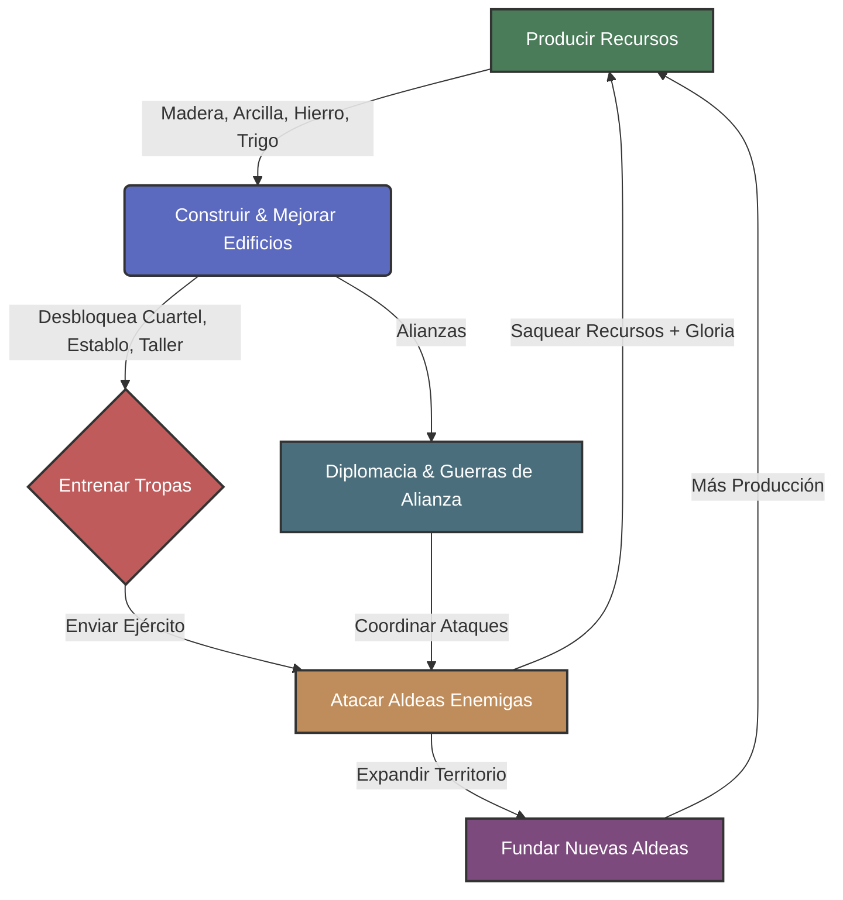

# 🎮 Visión General: Midgard Online

## 📝 Resumen

**Midgard Online** es un juego de estrategia MMO en navegador inspirado en Travian, ambientado en la mitología nórdica. Los jugadores construyen y expanden aldeas vikingas en un mundo compartido, compiten por recursos, entrenan ejércitos y forjan alianzas para dominar el mapa.

### Pitch (1 frase)

> "Construye tu aldea vikinga, entrena tu ejército nórdico y conquista el Midgard en un MMO estratégico de navegador."

| Campo                   | Valor                                                                     |
| ----------------------- | ------------------------------------------------------------------------- |
| **Título + Tagline**    | Midgard Online — Conquer the Nine Realms                                  |
| **Género + Plataforma** | MMO Strategy / City Builder — Web (100% browser, React + Node.js)         |
| **Core Loop (1 frase)** | Producir → Construir → Entrenar → Atacar → Saquear → Expandir → Producir  |
| **Target Audience**     | Mid-core strategy gamers, 16-40 años, fans de Travian/Tribal Wars/Ikariam |
| **Competidores**        | Travian, Tribal Wars, Ikariam, OGame, Grepolis                            |
| **Diferenciador**       | Temática nórdica auténtica + stack moderno (React/WS) + UX contemporánea  |

---

## 🔍 Análisis de Mercado

### Competidores Directos

| Juego           | Lanzamiento | Estado Actual        | Fortalezas                             | Debilidades                                            |
| --------------- | ----------- | -------------------- | -------------------------------------- | ------------------------------------------------------ |
| **Travian**     | 2004        | Activo (Legends)     | Economía profunda, PvP tenso, alianzas | UI anticuada, onboarding hostil, pay-to-win perception |
| **Tribal Wars** | 2003        | Activo (TW2 cerrado) | Simple y adictivo, gran comunidad      | Repetitivo a largo plazo, gráficos datados             |
| **Ikariam**     | 2008        | Activo               | Temática griega, comercio entre islas  | Baja tensión PvP, ritmo muy lento                      |
| **OGame**       | 2002        | Activo               | Sci-fi, espacio, alcance masivo        | Extremadamente lento, interfaz obsoleta                |
| **Grepolis**    | 2009        | Activo               | Mitología griega, poderes divinos      | P2W agresivo, servidores cada vez más vacíos           |

### Oportunidad de Mercado

El nicho de **browser-based strategy MMO** tiene una audiencia fiel (millones de jugadores activos entre Travian + Tribal Wars + Ikariam) pero **todos los competidores usan tecnología de 2004-2010**. Hay una oportunidad clara:

1. **UX moderna**: React SPA con animaciones fluidas vs. interfaces PHP de 2005
2. **Mobile-responsive**: Jugable en móvil sin app nativa (los competidores no lo son)
3. **Real-time feedback**: WebSocket para notificaciones instantáneas (ataques, construcciones)
4. **Temática nórdica**: Alta resonancia cultural (Vikings TV, God of War, Assassin's Creed Valhalla) — ningún competidor directo la explota en browser MMO
5. **Onboarding moderno**: Tutorial guiado, no un muro de texto como Travian

### Riesgos de Mercado

| Riesgo                                   | Probabilidad | Mitigación                                                       |
| ---------------------------------------- | ------------ | ---------------------------------------------------------------- |
| Audiencia nicho insuficiente             | Media        | El género probado con 20+ años de datos; enfocar en UX moderna   |
| Retención baja sin contenido social      | Alta         | Alianzas desde Fase 2, chat integrado, diplomacia                |
| Competidores lanzan modernización        | Baja         | Travian no ha renovado el core en 10 años; inercia institucional |
| Costes de servidor para MMO              | Media        | Arquitectura stateless + PostgreSQL; escalar bajo demanda        |
| Pay-to-win perception destruye confianza | Alta         | Monetización cosmética + velocidad, nunca stats exclusivas       |

---

## 🔄 Core Loop



### Detalle del Loop

1. **Producir**: 4 recursos base generados en tiempo real por edificios de producción. El trigo funciona como recurso de mantenimiento (tropas y edificios lo consumen).
2. **Construir**: Mejorar edificios sube producción, desbloquea tropas, aumenta almacenamiento. Cada upgrade tiene coste creciente y tiempo de construcción.
3. **Entrenar**: Reclutar tropas en Cuartel/Establo/Taller. Cada tipo tiene balance ataque/defensa/velocidad/carga.
4. **Atacar**: Enviar tropas a aldeas enemigas. Resultado calculado por fórmulas de combate. Ganador saquea recursos.
5. **Expandir**: Al alcanzar ciertos niveles, el jugador puede fundar nuevas aldeas en el mapa, multiplicando su producción.
6. **Diplomacia**: Alianzas de hasta 60 jugadores coordinan ataques, defienden territorios, negocian tratados.

---

## 👥 Audiencia Target

### Perfil Principal

| Atributo          | Valor                                                                   |
| ----------------- | ----------------------------------------------------------------------- |
| **Edad**          | 16-40 años                                                              |
| **Género**        | Predominantemente masculino (70/30), pero con diseño inclusivo          |
| **Plataforma**    | Desktop browser (principal), tablet/mobile browser (secundario)         |
| **Sesión típica** | 10-20 min × 3-5 veces al día (check-in) + 1 sesión larga de 30-60 min   |
| **Motivación**    | Progresión a largo plazo, competición social, planificación estratégica |
| **Referentes**    | Travian, Tribal Wars, Age of Empires, Civilization                      |

### Audience Assessment (Framework)

| Modo             | Sweet Spot        | Revenue Alignment          | Retention Projection       |
| ---------------- | ----------------- | -------------------------- | -------------------------- |
| Solo PvE (early) | 1 jugador         | Session IAP, speed-ups     | D1: 40%, D7: 15%, D30: 5%  |
| PvP Asimétrico   | 1v1 (raids)       | Competitive resources      | D7: +5% vs solo            |
| Co-op (Alianzas) | 20-60 activos     | Social stickiness, premium | D30: +8% vs sin alianza    |
| MMO World        | 500-2000/servidor | Economy, premium currency  | D30: +12% con mundo activo |

### Perfil del Jugador — Preferencias que contradicen al diseñador

1. **Prefieren esperar y planificar** más que acción inmediata (a diferencia de juegos mobile casuales)
2. **Valoran la política social** (alianzas, traiciones, diplomacia) tanto como el combate
3. **Toleran interfaces densas** si la información es útil (tablas de stats, reportes de batalla detallados)

---

## 💰 Modelo de Monetización

### Filosofía: Free-to-Play Ético

> **Regla de oro**: Un jugador free puede llegar a TODO el contenido. El pago compra **tiempo** y **comodidad**, nunca **poder exclusivo**.

### Moneda Premium: Runas de Odín

| Aspecto              | Detalle                                                                  |
| -------------------- | ------------------------------------------------------------------------ |
| **Nombre**           | Runas de Odín (premium currency)                                         |
| **Obtención F2P**    | Misiones diarias (5/día), logros, eventos especiales                     |
| **Obtención pago**   | Packs IAP ($0.99 - $99.99)                                               |
| **Conversión**       | NO convertible a recursos directamente                                   |
| **Usos principales** | Acelerar construcción/entrenamiento, 2do slot de construcción, cosmetics |

### Fuentes de Ingreso

| Canal                   | % Revenue Est. | Descripción                                                        |
| ----------------------- | -------------- | ------------------------------------------------------------------ |
| **Speed-ups**           | 35%            | Acelerar/completar construcción, entrenamiento, viaje de tropas    |
| **2do Constructor**     | 20%            | Slot adicional de construcción simultánea (como Travian Plus)      |
| **Battle Pass mensual** | 20%            | "Camino del Einherjar" — recompensas diarias, cosmetics exclusivos |
| **Packs de recursos**   | 15%            | Ofertas limitadas con recursos + speed-ups + runas                 |
| **Cosmetics**           | 10%            | Skins de aldea, avatares, marcos de perfil, efectos visuales       |

### Anti Pay-to-Win

- No se pueden comprar tropas directamente con Runas
- No hay unidades exclusivas de pago
- Los speed-ups reducen tiempo pero no eliminan el coste de recursos
- El 2do constructor es el "power" más fuerte — y es el estándar del género (Travian Plus lo hace)
- Matchmaking de servidores con "edad" similar para evitar que whales dominen desde el inicio

---

## 📈 KPIs Target

### Retención

| Métrica | Target | Benchmark Género | Justificación                                       |
| ------- | ------ | ---------------- | --------------------------------------------------- |
| **D1**  | 35%    | 30-40%           | Onboarding moderno + tutorial guiado                |
| **D7**  | 18%    | 15-22%           | Primera alianza + primer ataque PvP                 |
| **D30** | 10%    | 8-12%            | Alianza activa + progresión visible + segunda aldea |
| **D90** | 5%     | 3-6%             | Guerras de alianza + servidor competitivo           |

### Monetización

| Métrica        | Target  | Benchmark  | Justificación                                   |
| -------------- | ------- | ---------- | ----------------------------------------------- |
| **ARPDAU**     | $0.08   | $0.05-0.15 | Conservador para web F2P; crece con Battle Pass |
| **Conversion** | 3%      | 2-5%       | 2do constructor como gateway drug               |
| **ARPPU**      | $12/mes | $8-20      | Battle Pass $4.99 + speed-ups ocasionales       |
| **LTV (D180)** | $8      | $5-15      | Basado en D30 retention × ARPDAU × 180          |

### Engagement

| Métrica                | Target   | Justificación                            |
| ---------------------- | -------- | ---------------------------------------- |
| **DAU/MAU**            | 25%      | Estándar para strategy (high stickiness) |
| **Sessions/día**       | 3-5      | Check-in model (construcción/ataques)    |
| **Avg session length** | 8-15 min | Sesiones cortas frecuentes               |
| **Time to 1st PvP**    | < 48h    | Motivación temprana                      |

---

## 🎯 X-Factor Assessment

| Componente               | Evaluación                                                                   | Score     |
| ------------------------ | ---------------------------------------------------------------------------- | --------- |
| **Relevancia cultural**  | Mitología nórdica en pico de popularidad (Vikings, GoW, AC Valhalla)         | 5/5       |
| **Promesa emocional**    | "De una choza vikinga a un imperio que domina el mapa" — power fantasy clara | 4/5       |
| **Sinergia arte+diseño** | Estética nórdica amplifica mecánicas de conquista y alianzas tribales        | 4/5       |
| **Cohesión**             | Todo feature debe sentirse "nórdico" y "estratégico-social"                  | 4/5       |
| **Total**                |                                                                              | **17/20** |

**Veredicto:** ✅ APROBADO (umbral: 12/20)

---

## 🏗️ Tech Stack

| Componente        | Tecnología                     | Justificación                                      |
| ----------------- | ------------------------------ | -------------------------------------------------- |
| **Frontend**      | React + Vite + TypeScript      | SPA moderna, HMR rápido, tipado fuerte             |
| **Backend**       | Node.js + Express + TypeScript | Ecosistema compartido con frontend, async nativo   |
| **Base de datos** | PostgreSQL                     | Relacional robusto para MMO (aldeas, tropas, mapa) |
| **Real-time**     | WebSocket (Socket.io)          | Notificaciones de ataques, chat, eventos en vivo   |
| **Cache**         | Redis (futuro)                 | Sesiones, datos calientes del mapa                 |
| **Hosting**       | VPS / Cloud (AWS/DigitalOcean) | Escalable por servidor de juego                    |

### Estructura de Carpetas

```
games/midgard-online/
├── game.json              # Manifest del juego
├── config/                # JSON configs (source of truth para game data)
├── docs/                  # GDD completo
│   └── art/               # Style guide y assets
├── sandbox-web/           # React frontend (ES EL JUEGO)
│   ├── src/
│   │   ├── components/    # UI components
│   │   ├── hooks/         # Game logic hooks
│   │   ├── pages/         # Vistas principales
│   │   ├── services/      # API + WebSocket clients
│   │   └── config/        # JSON configs cargados
│   └── public/
└── backend/               # Node.js server
    ├── src/
    │   ├── routes/        # REST API endpoints
    │   ├── services/      # Game logic (production, combat, etc.)
    │   ├── models/        # Database models (Sequelize/Prisma)
    │   ├── ws/            # WebSocket handlers
    │   └── config/        # Server config + JSON game data
    └── database/
        └── migrations/    # SQL migrations
```

---

## 🗺️ Roadmap

### Fase 1 — Fundación (v0.1.0) — 4-6 semanas

**Objetivo:** Jugador solo puede construir una aldea y producir recursos.

| Feature                            | Prioridad | Scope |
| ---------------------------------- | --------- | ----- |
| Sistema de 4 recursos              | P0        | S     |
| 6 edificios de producción/almacén  | P0        | M     |
| Gran Salón (building principal)    | P0        | S     |
| UI de aldea (grid de edificios)    | P0        | M     |
| Timers de construcción             | P0        | S     |
| Backend: auth + CRUD de aldeas     | P0        | M     |
| Producción en tiempo real (server) | P0        | M     |

**KPI de fase:** Jugador puede jugar 30 min sin quedarse sin cosas que hacer.

### Fase 2 — Combate (v0.2.0) — 4-6 semanas

**Objetivo:** PvP funcional. Los jugadores pueden atacarse entre sí.

| Feature                           | Prioridad | Scope |
| --------------------------------- | --------- | ----- |
| Edificios militares (3)           | P0        | M     |
| 6-8 tipos de tropas               | P0        | L     |
| Sistema de combate (fórmulas)     | P0        | M     |
| Muralla (defensa)                 | P0        | S     |
| Mapa del mundo (grid)             | P0        | L     |
| Enviar tropas + resolver combate  | P0        | L     |
| Reportes de batalla               | P1        | M     |
| WebSocket: notificación de ataque | P1        | M     |

**KPI de fase:** 60% de jugadores D3 hacen al menos 1 ataque.

### Fase 3 — Social (v0.3.0) — 4-6 semanas

**Objetivo:** Alianzas y la capa social que retiene a largo plazo.

| Feature                             | Prioridad | Scope |
| ----------------------------------- | --------- | ----- |
| Sistema de alianzas                 | P0        | M     |
| Chat de alianza                     | P0        | M     |
| Diplomacia (aliado/neutral/enemigo) | P1        | S     |
| Oasis (bonus de recursos en mapa)   | P1        | M     |
| Fundar segunda aldea                | P0        | L     |
| Rankings (jugadores + alianzas)     | P1        | S     |
| Eventos del servidor                | P2        | M     |

**KPI de fase:** D30 retention alcanza 10%. 50% de jugadores activos están en una alianza.

### Fase 4 — Monetización & Polish (v1.0.0) — 6-8 semanas

**Objetivo:** Free-to-play viable con monetización ética.

| Feature                            | Prioridad | Scope |
| ---------------------------------- | --------- | ----- |
| Runas de Odín (premium currency)   | P0        | M     |
| Speed-ups con Runas                | P0        | S     |
| 2do slot de construcción           | P0        | S     |
| Battle Pass "Camino del Einherjar" | P0        | L     |
| Cosmetics (skins aldea, avatares)  | P1        | M     |
| Tutorial/onboarding guiado         | P0        | M     |
| Balanceo post-beta                 | P0        | L     |
| Servidor de lanzamiento            | P0        | M     |
| Landing page + marketing           | P1        | M     |

**KPI de fase:** Conversion rate 3%. ARPDAU $0.08. Servidor estable con 500+ jugadores.

---

## 🏆 Elegance Audit

### 1. Perfil del Jugador ✅

| Preferencia de la audiencia                         | ¿Contradice al diseñador?    |
| --------------------------------------------------- | ---------------------------- |
| Prefieren esperar horas entre acciones estratégicas | Sí (quiero acción inmediata) |
| Valoran la política social más que el combate puro  | Sí (quiero pelear)           |
| Toleran interfaces densas con tablas y datos        | Sí (quiero UI minimalista)   |

**Empatía validada:** ✅ SÍ

### 2. Mapeo Desafío→Acción ✅

| Acción del Jugador      | Desafío Vinculado                          | ¿No-Trivial? |
| ----------------------- | ------------------------------------------ | ------------ |
| Construir edificio      | Económico (gestión de 4 recursos + tiempo) | ✅           |
| Elegir qué mejorar      | Lógica (priorización de upgrades)          | ✅           |
| Entrenar tropas         | Económico (coste + consumo trigo)          | ✅           |
| Atacar otra aldea       | Conflicto (riesgo de perder tropas)        | ✅           |
| Elegir target de ataque | Exploración (scout + evaluar defensa)      | ✅           |
| Unirse a alianza        | Coordinación (social, compromisos)         | ✅           |
| Fundar nueva aldea      | Lógica + Económico (requiere progresión)   | ✅           |

**Features gratuitas detectadas:** Ninguna. Cada acción tiene coste o riesgo.

### 3. Economía Interna ✅

- **Source→Sink definido:** SÍ (producción → construcción/entrenamiento/mantenimiento trigo)
- **Estrategia dominante detectada:** Pendiente de validación por @qa post-diseño numérico

---

## ✅ Decisión del Producer

### Concepto: **APROBADO — GO**

**Business Justification:**

- Mercado probado con 20+ años de audiencia activa (Travian tiene 100M+ cuentas históricas)
- Todos los competidores usan tech obsoleta — oportunidad de disrupción por UX
- Temática nórdica en pico cultural — awareness gratuito
- Modelo F2P ético con benchmark de Travian Plus como referencia
- Tech stack moderno permite iteración rápida (React + Node.js)

**Scoring del Producer:**

| Criterio         | Weight | Score | Weighted            |
| ---------------- | ------ | ----- | ------------------- |
| Retention Impact | 30%    | 8/10  | 2.4                 |
| Monetization     | 25%    | 7/10  | 1.75                |
| Development Cost | 20%    | 7/10  | 1.4                 |
| Player Fun       | 25%    | 8/10  | 2.0                 |
| **Total**        |        |       | **7.55/10 (75.5%)** |

**Resultado:** > 70% → ✅ APROBADO

---

## 📌 Next Step

> **@gamedesign** debe diseñar el sistema de recursos y edificios de producción con números concretos (Niveles 1-10, costes, tiempos, producción/hora). Seguir el prompt del Paso 2 en [pipeline-playbook.md](pipeline-playbook.md).

---

_Aprobado por `@producer` — 2026-02-23_
